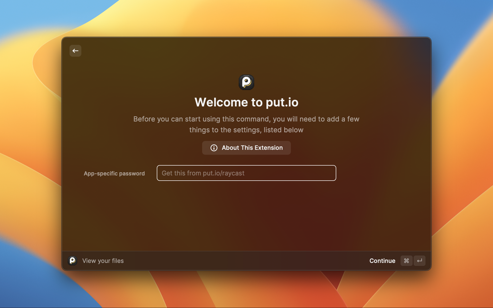
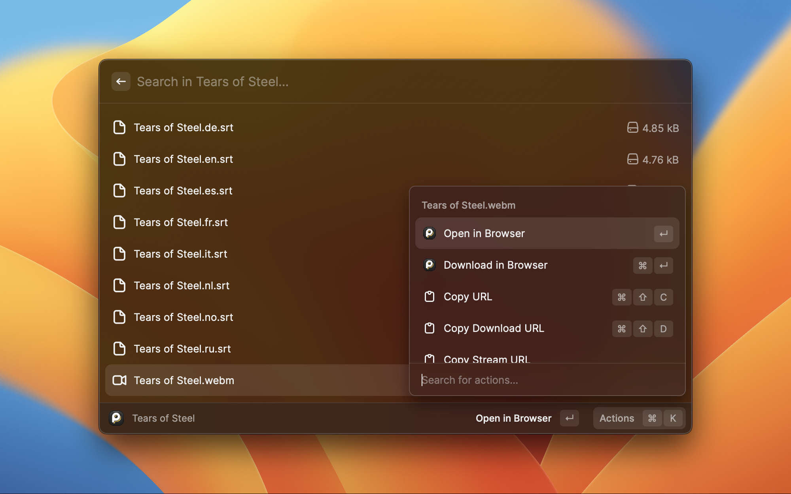
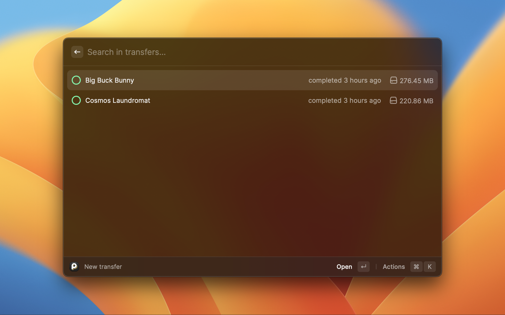

  

<h1 align="center">put.io Raycast extension</h1>

  <a href="https://www.raycast.com">Raycast</a> extension for managing files, transfers, and history events in your put.io account.

  
  
  

